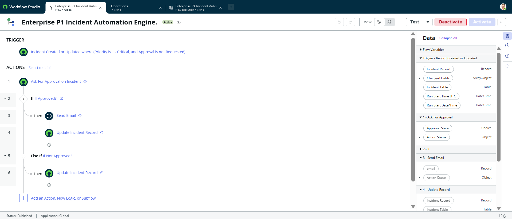
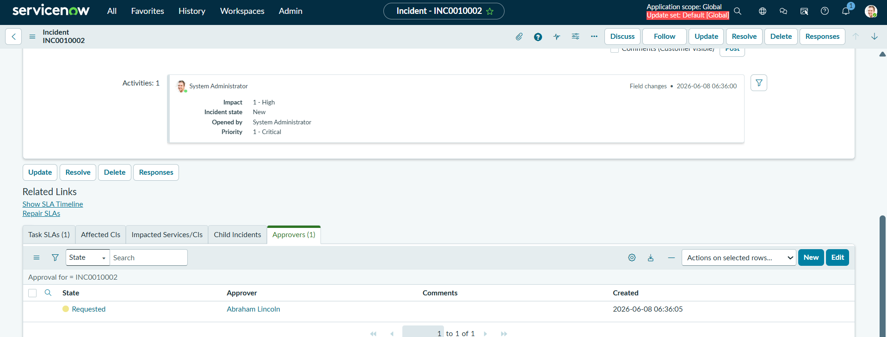
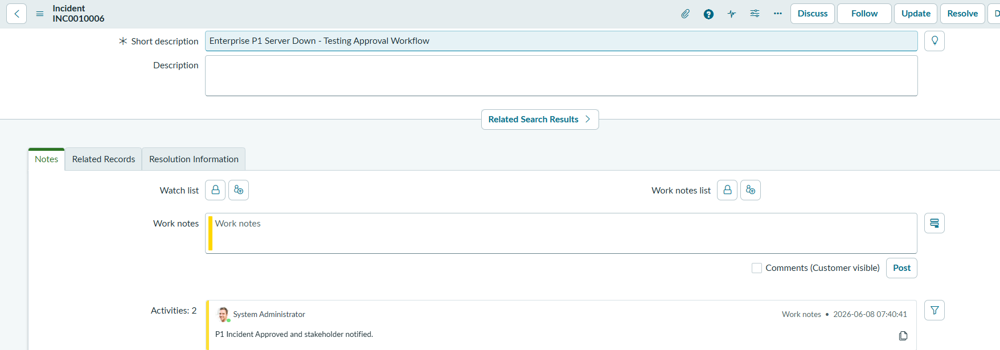
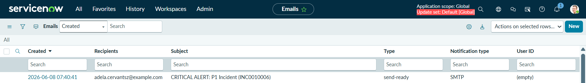

# Project 1: Enterprise P1 Incident Automation & Approval Workflow Engine

## 📌 Project Overview
This project automates the lifecycle of Priority 1 (P1) Critical Incidents inside the ServiceNow platform using **Flow Designer**. The flow automatically triggers a management approval request when a P1 ticket is generated, roots the process based on approval/rejection outcomes, and logs automated audit trails to the record.

---

## 🛠️ Step-by-Step Implementation Details

### Step 1: Flow Setup & Trigger
* **Flow Name:** `Enterprise P1 Incident Automation Engine`
* **Trigger:** Created or Updated (For every update)
* **Condition:** `[Priority] [is] [1 - Critical]` AND `[Approval] [is] [Not Requested]`

### Step 2: Main Logic & Actions
1. **Action 1 (Ask For Approval):** Added ServiceNow Core approval routing targeted at the designated management group.
2. **Action 2 (If Approved Branch):** * **Send Email:** Triggers an automated corporate alert to high-level stakeholders containing dynamic ticket data.
   * **Update Record:** Commits an automated update to `Work notes`: *"P1 Incident Approved and stakeholders notified."*
3. **Action 3 (Else If Rejected Branch):**
   * **Update Record:** Automatically sets the ticket to `State: On Hold`, `On Hold Reason: Awaiting Review`, and logs `Work notes`: *"P1 Incident rejected by Management."*

---

## 🚀 Real-World Implementation Challenges & Resolutions (Debugging Phase)

During the deployment and testing of this workflow inside the PDI, two technical challenges were caught and successfully resolved:

### 🔍 Issue 1: Missing Approvals Related List on Incident Form
* **Problem:** The flow generated the approval records successfully, but the "Approvals" tracking section was completely missing at the bottom of the Incident form layout.
* **Root Cause:** In standard PDIs, task tracking lists are occasionally excluded from default form views.
* **Resolution:** Navigated to `Configure -> Related Lists`, found the `Approvers` block, and pushed it to the active UI visibility column to bring up live tracking.

### 🔍 Issue 2: Flow Halting Mid-Way Due to Empty Target Fields (Null Value)
* **Problem:** Upon marking the ticket as "Approved," subsequent workflow nodes froze instantly, and the automated Work Notes failed to post to the activity stream.
* **Root Cause Analysis:** Investigated the **Flow Designer Execution Logs** and traced a hard failure error: `Email validation failed: Email has no recipients`. The email task's `To` field was initially mapped using a dot-walked path: `Trigger -> Incident Record -> Assigned to -> Email`. Because newly born P1 incidents are unassigned, this path returned a **Null** object, crashing the workflow engine before it could reach the Work Notes node.
* **Resolution:** Abstracted the empty dynamic relational pill from the communication node and replaced it with a valid testing mailbox string to safely clear engine validation parameters.

---

## 📸 Project Proof & Screenshots

### 1. Flow Studio Architecture

### 2. Live Process Trigger & Approval Generated

### 3. Management Sign-off Audit Trails Update

### 4. Dynamic Outbound Outbound Email Log

